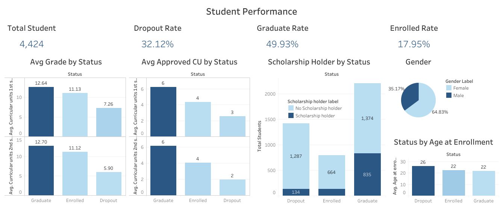

# Menyelesaikan Permasalahan Institusi Pendidikan pada Jaya Jaya Institut

## Business Understanding

### Latar Belakang Bisnis
Jaya Jaya Institut adalah institusi pendidikan terkemuka yang berfokus pada peningkatan mutu akademik serta kepuasan mahasiswa. Namun, belakangan ini, tingkat dropout (pengunduran diri mahasiswa) meningkat secara signifikan. Proyek ini bertujuan untuk menganalisis faktor-faktor yang memengaruhi dropout mahasiswa. Dengan menggunakan data karakteristik demografis, akademik, dan sosial ekonomi mahasiswa, analisisdilakukan  untuk mengidentifikasi pola-pola yang berhubungan dengan status mahasiswa, yaitu apakah mereka dropout, masih terdaftar (enrolled), atau lulus (graduate). Hasil dari analisis ini dapat digunakan untuk mengembangkan strategi untuk mengurangi tingkat dropout dan meningkatkan keberhasilan mahasiswa.

---

## Permasalahan Bisnis
1. Apa faktor-faktor utama yang menyebabkan siswa mengundurkan diri?
2. Bagaimana memprediksi siswa yang berisiko tinggi untuk keluar?
3. Apa rekomendasi strategis untuk mengurangi tingkat attrition berdasarkan analisis data?

---

## Cakupan Proyek
Proyek ini akan mencakup beberapa langkah utama:
1. **Analisis data eksplorasi (EDA):** Memahami pola dan hubungan dalam data, serta mengeksplorasi faktor-faktor yang berkontribusi terhadap dropout.
2. **Preprocessing dan rekayasa fitur:** Mengonversi fitur kategorikal menjadi numerik, normalisasi data, membagi data, mengatasi ketidakseimbangan kelas, dan meng-encode label/target.
3. **Pengembangan model prediktif:** Menggunakan algoritma machine learning untuk memprediksi siswa yang berisiko tinggi keluar.
4. Mendeploy model prediksi menggunakan Streamlit agar mudah diakses oleh pengguna.
5. **Pembuatan business dashboard:** Menggunakan Tableau untuk menyajikan informasi terkait status mahasiswa secara visual dan interaktif.
6. **Penyusunan rekomendasi berbasis data:** Memberikan saran strategis untuk mengurangi tingkat attrition.

---

## Persiapan

### Sumber Data
Dataset berasal dari UCI Machine Learning [Predict Students' Dropout and Academic Success](https://archive.ics.uci.edu/dataset/697/predict+students+dropout+and+academic+success). Dataset ini berisi informasi mengenai karakteristik demografis, akademik, dan sosial ekonomi mahasiswa, termasuk status pernikahan, tingkat pendidikan orang tua, pekerjaan orang tua, program studi yang diambil, beasiswa, dan informasi terkait keuangan dan sosial. Target variabel adalah status mahasiswa pada akhir studi, yaitu apakah mereka drop out, masih terdaftar, atau lulus. Dataset berisi kolom-kolom seperti:
1. **Marital Status** (Integer): Menunjukkan status pernikahan mahasiswa dengan kode numerik:
   - 1: Single
   - 2: Married
   - 3: Widower
   - 4: Divorced
   - 5: Facto union
   - 6: Legally separated

2. **Application Mode** (Integer): Menunjukkan mode aplikasi yang digunakan oleh mahasiswa. Kode numerik seperti:
   - 1: 1st phase - general contingent
   - 2: Ordinance No. 612/93
   - 5: 1st phase - special contingent (Azores Island)
   - 15: International student (bachelor)
   - 39: Over 23 years old

3. **Application Order** (Integer): Urutan pilihan aplikasi mahasiswa (0 - pertama hingga 9 - terakhir).

4. **Course** (Integer): Kode program studi yang dipilih mahasiswa. Kode-kode program studi seperti:
   - 33: Biofuel Production Technologies
   - 171: Animation and Multimedia Design
   - 8014: Social Service (evening attendance)
   - 9003: Agronomy

5. **Daytime/Evening Attendance** (Integer): Waktu kuliah mahasiswa, dengan nilai:
   - 1: Daytime
   - 0: Evening

6. **Previous Qualification** (Integer): Jenjang pendidikan sebelumnya yang dimiliki mahasiswa, dengan kode seperti:
   - 1: Secondary education
   - 2: Higher education - bachelor's degree
   - 3: Higher education - degree
   - 4: Higher education - master's

7. **Previous Qualification (Grade)** (Continuous): Nilai atau grade dari kualifikasi sebelumnya, berada dalam rentang 0 hingga 200.

8. **Nationality** (Integer): Kode kewarganegaraan mahasiswa, seperti:
   - 1: Portuguese
   - 2: German
   - 41: Brazilian
   - 62: Romanian

Dan seterusnya. Penjelasan lengkap mengenai kolom yang ada pada dataset ada di [sini](https://archive.ics.uci.edu/dataset/697/predict+students+dropout+and+academic+success).

### Setup Environment
#### 1. Instalasi Library
Pastikan library berikut telah terinstal:
```bash
pip install pandas numpy matplotlib seaborn scikit-learn xgboost imbalanced-learn joblib
```

#### 2. Setup Environment untuk Visualisasi Dashboard
Business dashboard dibuat menggunakan Tableau. Anda dapat mengunduh Tableau Public dari [situs resmi Tableau](https://public.tableau.com/). Selanjutnya file dataset dapat diunggah ke Tableau untuk membuat visualisasi.

#### 3. Setup Environment untuk Streamlit
- Download file yang dibutuhkan, yaitu file streamlit ```streamlit_app.py```, file model machine learningnya ```best_rf_model.joblib```, dan file preprocessornya ```preprocessor_model.joblib```.

- Instal Streamlit dan library tambahan lainnya:
```pip install streamlit pandas scikit-learn numpy joblib category_encoders ```

- Jalankan Aplikas Streamlit:
Untuk menjalankan aplikasi Streamlit, gunakan perintah berikut:
```streamlit run app.py```

---

## Analisis Data dan Model Prediktif

### Exploratory Data Analysis (EDA)
1. Ada 32.12% student yang dropout dari total 4424 student. Kemudian sekitar 49.93% student graduate dan 17.95% student dengan status enrolled.
2. Mahasiswa yang dropout sebanyak 97.75% adalah mahasiswa yang bukan dari international. Dengan hanya 2.25% student international yang dropout.
3. Mahasiswa yang dropout sekitar 98.80% nya adalah yang bukan berkebutuhan khusus. Dengan hanya 1.20% mahasiswa berkebutuhan khusus yang dropout.
4. Mahasiswa yang dropout sekitar 78.04% nya adalah yang tidak memiliki hutang. Dengan 21.96% mahasiswa dropout yang memiliki hutang. Artinya 1/5 mahasiswa yang dropout memiliki hutang.

### Preprocessing dan Rekayasa Fitur
1. **Encoding Categorical Features dan Target/Label:**
   - Menggunakan teknik encoding untuk mengonversi fitur kategorikal dan Target/Label yaitu kolom Status menjadi numerik.
3. **Scaling:**
   - Data dinormalisasi menggunakan `StandardScaler` untuk menyetarakan skala fitur.
4. **Membagi Data dan Mengatasi Ketidakseimbangan Kelas:**
   - Data dibagi 80:20 untuk pelatihan dan pengujian. SMOTE diterapkan pada data pelatihan untuk mengatasi ketidakseimbangan kelas target "Attrition".

### Model Prediktif
Model yang digunakan:
| **Metrik**       | **Random Forest** | **XGBoost**   |
|------------------|-------------------|---------------|
| **Accuracy**     |       77.40%      | 75.71%        |
| **Precision**    |       77.20%      | 75.02%        |
| **Recall**       |       77.40%      | 75.71%        |
| **F1-Score**     |       77.05%      | 74.99%        |

Hasil menunjukkan bahwa Random Forest lebih unggul dalam semua metrik evaluasi dibandingkan XGBoost.

---

## Business Dashboard
Dashboard ini memberikan visualisasi interaktif tentang faktor-faktor yang memengaruhi dropout rate, termasuk:
1. Tingkat dropout berdasarkan beasiswa.
2. Tingkat dropout berdasarkan nilai semester.
3. Tingkat dropout berdasarkan usia ketika berkuliah.

Dashboard dapat diakses melalui [link berikut](https://public.tableau.com/app/profile/deva.pratama/viz/StudentPerformance_17356384602850/Dashboard3?publish=yes)



## Streamlit Web App
Untuk prediksi student performance dengan streamlit dapat diakses melalui link berikut: https://student-performance-predictions.streamlit.app/

---

## Kesimpulan

Kesimpulan
Berdasarkan visualisasi data yang diberikan mengenai performa akademik siswa, berikut adalah beberapa kesimpulan utama:
1. Distribusi Status: Dari total 4,424 siswa, 49.93% berhasil lulus (Graduate), 32.12% mengalami dropout (Dropout), dan 17.95% masih terdaftar (Enrolled).
Rata-rata Nilai dan Unit Kurikuler yang Disetujui:
2. Siswa yang lulus memiliki rata-rata nilai tertinggi di semester pertama (12.64) dan kedua (12.70), serta jumlah unit kurikuler yang disetujui tertinggi (6 unit di kedua semester).
3. Siswa yang masih terdaftar menduduki posisi kedua dalam hal rata-rata nilai (11.13 di semester pertama, 11.12 di semester kedua) dan unit kurikuler yang disetujui (4 unit di kedua semester).
4. Siswa yang dropout memiliki nilai rata-rata terendah (7.26 di semester pertama, 5.90 di semester kedua) dan jumlah unit kurikuler yang disetujui paling rendah (3 unit di semester pertama, 2 unit di semester kedua).
5. Pemegang Beasiswa: Terdapat perbedaan signifikan dalam jumlah pemegang beasiswa berdasarkan status akademik mereka. Mayoritas siswa yang lulus (1,287) dan terdaftar (835) tidak memegang beasiswa, sementara hanya sedikit yang dropout (134) yang memegang beasiswa.
6. Usia pada Saat Pendaftaran: Rata-rata usia pendaftaran untuk siswa yang dropout adalah 26 tahun, sedangkan untuk yang terdaftar dan lulus adalah 22 tahun. Ini menunjukkan bahwa siswa yang lebih tua cenderung lebih rentan untuk dropout.

Random Forest dipilih sebagai model terbaik dengan akurasi 77.40% dan F1-Score 77.05%.

---

## Rekomendasi Action Items
1. Program Dukungan Akademik untuk Dropout: Kembangkan program bantuan akademik yang berfokus pada siswa dengan nilai rendah, khususnya mereka yang berusia lebih tua. Program ini bisa mencakup bimbingan belajar, sesi konseling akademik, dan workshop manajemen waktu.
2. Evaluasi dan Penyesuaian Beasiswa: Analisis lebih lanjut mengenai dampak beasiswa terhadap keberhasilan akademik. Pertimbangkan untuk memperluas kriteria beasiswa atau menawarkan jenis dukungan finansial lain bagi siswa yang mungkin tidak memenuhi kriteria tradisional beasiswa tapi membutuhkan bantuan.
3. Studi Usia dan Kesuksesan Akademik: Lakukan penelitian lebih lanjut untuk memahami faktor-faktor yang mempengaruhi dropout di kalangan siswa yang lebih tua. Pertimbangkan untuk menawarkan program khusus atau fleksibilitas dalam kurikulum yang dapat menyesuaikan dengan kebutuhan siswa yang bekerja atau memiliki tanggung jawab lain.
